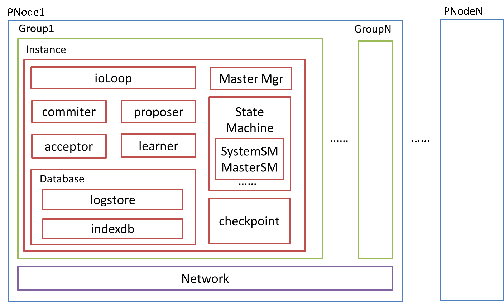
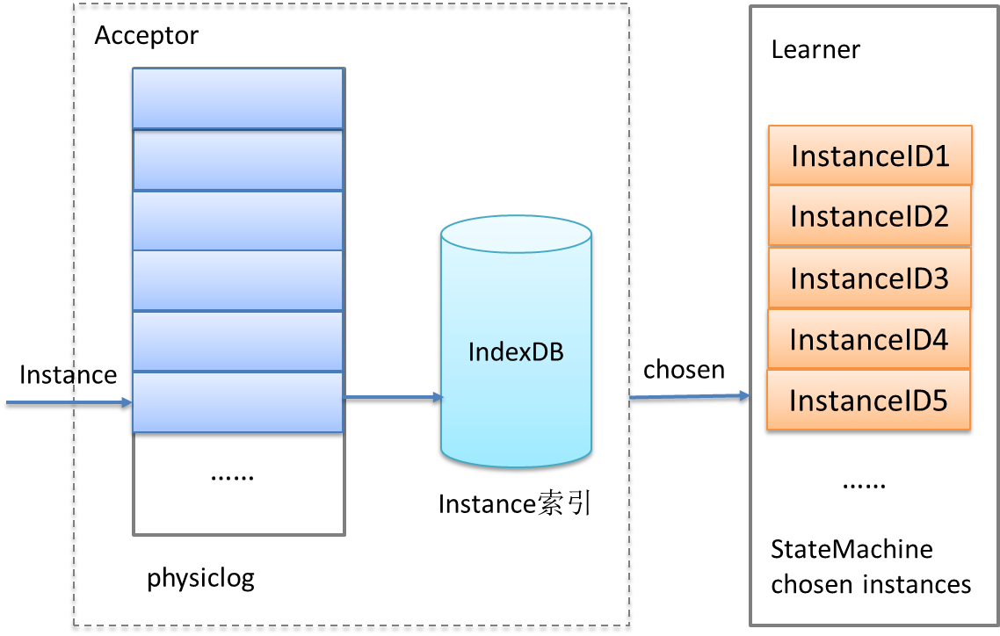
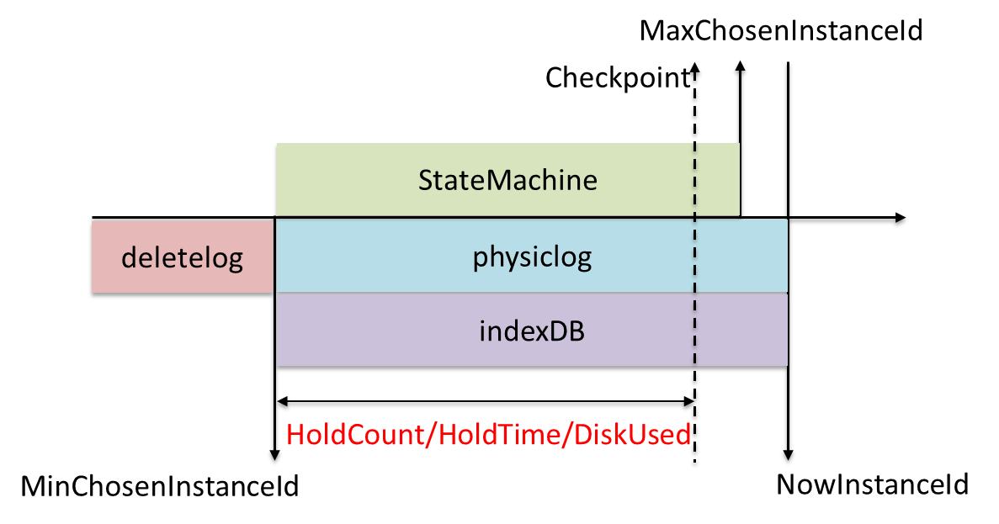

# WPaxos project structure

## PNode

The WPaxos service cluster includes multiple independent physical Node nodes, each Node node has a fixed number of Paxos Groups, and each group runs a Paxos instance. Multiple Paxos Groups can simultaneously determine the ordered sequence of multiple groups of increasing instanceIDs, Paxos Each time an instance determines a value and submits it to the state machine for successful execution, the instanceID is increased by 1. Once the value corresponding to an instanceID is determined, it will not be modified afterwards.
## Logstorage
The storage module business can be customized. In order to ensure that the submitted instance data is not lost under any circumstances, the Node node log storage PaxosLog needs to persistently store all the instance data accepted by the Acceptor in real time, and each instance data needs to support random reading. For this reason, WPaxos default PaxosLog storage consists of two parts: physical files and IndexDB indexes. As shown in the figure below, IndexDB is implemented by LevelDB by default, physiclog uses file sequential write + synchronous flashing, and IndexDB uses asynchronous flashing. When the process is abnormal When it hangs, as long as the physiclog data is not lost, it can be replayed through PaxosLog to restore the index number in IndexDB.
  
However, in actual tests, it was found that the LevelDB asynchronous write interface often has a storage jitter of several hundred milliseconds. In order to solve this problem, when the number of Paxos groups is relatively small, we changed the IndexDB implementation to the memory cache + asynchronous file writing method to solve the jitter At the same time, it is convenient for batch cleaning of historical logs in file units.
WPaxos also supports three ways to clean PaxosLog history logs according to the number of instances reserved (HoldCount), retention time (HoldTime), and disk space occupancy.

## StateMachine
A Paxos instance can mount a variety of state machines. Among them, Master StateMachine and System StateMachine are built-in state machines for the service. The former is used to implement Master election and renewal state management, and the latter is used to implement dynamic change management of Member Ship members. Users can add core business logic to the execute method of a custom state machine for execution. When any node in a Paxos instance executes the same instance data, all data states of the state machine seen by it are consistent.
## Checkpoint
Checkpoint is a snapshot of state machine data. The state machine can perform real-time update snapshots through the execute method, and can also be generated asynchronously by rereading data in the checkpoint replayer. The state machine data can be restored through snapshots, but Checkpoint synchronization is a relatively heavy process, and all history needs to be deleted. Data to reconstruct the state machine. In the Paxos instance, any node can be used as a Learner, and periodically ask other nodes whether their data is behind. If the maximum instanceID of a node is less than the minimum chosen instanceID of all nodes that return Ack within a certain period of time, the synchronization checkpoint is selected to align the data.
## Network
Similarly, users of the network communication module can also customize it. In the default implementation of WPaxos, you can specify how many groups of network IO instances to create, and each group of instances will initialize a TCP connection and UDPClient between this node and all other nodes in the Paxos instance. In a Paxos instance, all requests from the same node are serial, so the default number of initialized IO instances is the number of Paxos Groups, which can meet the performance maximization requirements.
